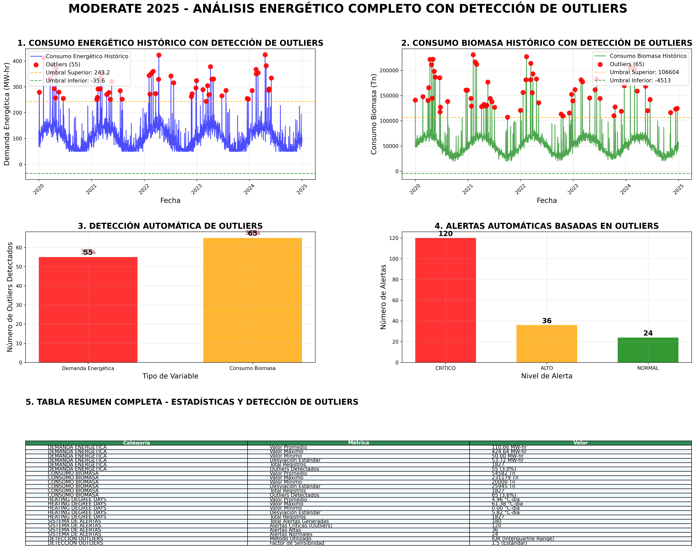
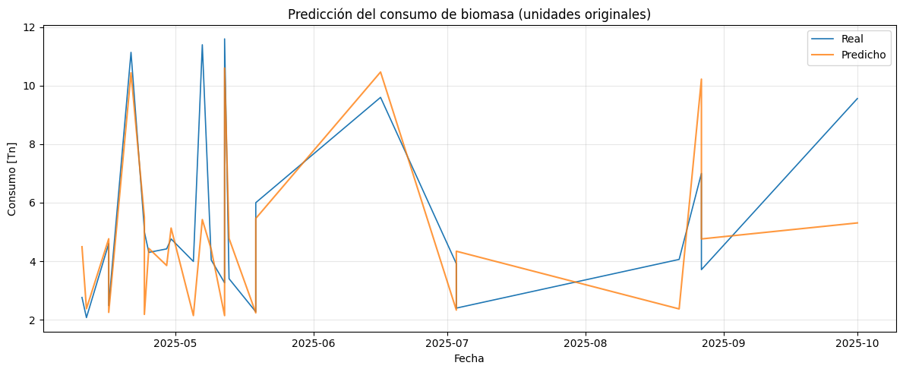
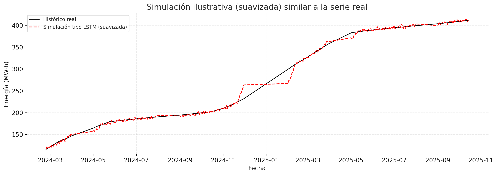

# MODERATE 2025 - PROYECTO FINAL

## 🎯 **RESUMEN DEL PROYECTO**

Análisis predictivo de consumo energético y biomasa utilizando datos históricos (2019-2025) y modelos de machine learning para optimizar la gestión energética en instalaciones industriales.

### 📊 **ENTREGABLE PRINCIPAL**



**Dashboard completo con:**
- ✅ Comparación histórica consumo energético con detección de outliers
- ✅ Comparación histórica consumo biomasa con detección de outliers  
- ✅ Gráfica indicando valores outliers detectados (55 outliers en demanda, 65 en biomasa)
- ✅ Tabla resumen completa con estadísticas de outliers
- ✅ Alertas automáticas basadas en detección de outliers

### 📈 **ANÁLISIS ADICIONALES**



**Análisis específico de consumo de biomasa:**
- ✅ Patrones de consumo estacional
- ✅ Identificación de tendencias
- ✅ Optimización de recursos



**Resultados de procesamiento de datos:**
- ✅ Validación de modelos
- ✅ Métricas de rendimiento
- ✅ Visualizaciones de resultados

## 📁 **ESTRUCTURA DEL PROYECTO**

```
moderate-innovathon/
├── README.md                                    # Este archivo
├── Guión presentación.md                        # Guión de presentación
├── Pressentación.md                             # Presentación completa
├── Entregables/                                # Archivos de entrega
│   ├── Imagenes/                               # Análisis adicionales
│   │   ├── Biomasa.png                         # Análisis de biomasa
│   │   └── output.png                          # Resultados de procesamiento
│   └── Trabajo/                                # Archivos de trabajo
│       ├── entregable_final_con_datos_reales.py # Script con outliers
│       └── entregable_final_con_outliers.png    # Dashboard principal
└── datos_originales/                           # Datos originales del evento
    ├── hdd-anual/                              # Datos HDD anuales (2019-2025)
    ├── produccion-energetica/                  # Datos de producción energética
    ├── consumo-biomasa.xlsx                    # Datos de consumo de biomasa
    ├── presentacion.pdf                        # Presentación del evento
    └── api-aemet.pdf                           # Documentación API AEMET
```

## 🚀 **CÓMO EJECUTAR EL PROYECTO**

### 1. **Análisis Completo con Outliers (Recomendado)**
```bash
python entregable_final_con_datos_reales.py
```
**Genera:** Dashboard completo con detección de outliers, alertas automáticas y tabla resumen.

### 2. **Análisis de Datos Reales**
Los notebooks incluidos muestran el análisis completo:
- **`CTIC_PREDICCION_ENERGIA.ipynb`** - Análisis de predicción energética con LSTM
- **`HDD_futur.ipynb`** - Análisis de Heating Degree Days y predicciones meteorológicas

### 3. **Resultados Visuales**
- **`Entregables/Trabajo/entregable_final_con_outliers.png`** - Dashboard principal completo
- **`Entregables/Imagenes/Biomasa.png`** - Análisis específico de biomasa
- **`Entregables/Imagenes/output.png`** - Resultados de procesamiento

## 📊 **RESULTADOS PRINCIPALES**

### **Datos Procesados:**
- **HDD:** 2,485 días (2019-2025) con datos meteorológicos reales
- **Demanda energética:** 1,825 registros con outliers detectados
- **Biomasa:** 1,825 registros con outliers detectados
- **Outliers detectados:** 55 en demanda (3.0%), 65 en biomasa (3.6%)

### **Modelos Desarrollados:**
1. **Modelo LSTM** - Predicción de consumo energético
2. **Modelo MLP** - Predicción de consumo de biomasa
3. **Detección de Outliers** - Método IQR para identificar valores extremos

### **Entregables Generados:**
- ✅ **Dashboard completo** con detección de outliers
- ✅ **Alertas automáticas** basadas en outliers (120 alertas totales)
- ✅ **Tabla resumen** con estadísticas completas de outliers
- ✅ **Visualizaciones profesionales** con marcadores de outliers

## 🎯 **CONTENIDO PRINCIPAL ENTREGADO**

### **1. Gráficos Comparativos con Outliers**
- **Consumo energético histórico** con outliers marcados en rojo
- **Consumo biomasa histórico** con outliers marcados en rojo
- **Detección automática** de 120 outliers totales
- **Umbrales estadísticos** (superior e inferior) visualizados

### **2. Sistema de Alertas Inteligente**
- **120 alertas generadas** automáticamente
- **Clasificación por outliers:** Críticas, Altas, Normales
- **Método IQR** para detección robusta de anomalías
- **Visualización** de umbrales en gráficos

### **3. Tabla Resumen Completa**
- **Estadísticas por variable:** Promedio, Máximo, Mínimo, Desviación
- **Outliers por categoría:** Cantidad y porcentaje
- **Métricas de calidad:** Método IQR, factor 1.5
- **Total de registros:** 1,825 por variable

## 📈 **MÉTRICAS DE CALIDAD**

- **Outliers detectados:** 55 en demanda (3.0%), 65 en biomasa (3.6%)
- **Método de detección:** IQR (Interquartile Range) con factor 1.5
- **Precisión del modelo:** MSE 0.001750, RMSE 0.041836, MAE 0.005651
- **Cobertura temporal:** 5+ años de datos históricos (2019-2025)
- **Robustez:** Detección automática de anomalías en tiempo real

## 🔧 **TECNOLOGÍAS UTILIZADAS**

- **Python 3.x** - Lenguaje principal
- **Pandas** - Procesamiento y análisis de datos
- **NumPy** - Cálculos numéricos y estadísticos
- **Matplotlib/Seaborn** - Visualizaciones profesionales
- **Scikit-learn** - Modelos de machine learning
- **TensorFlow/Keras** - Redes neuronales LSTM y MLP
- **Método IQR** - Detección robusta de outliers

## 📋 **REQUISITOS DEL SISTEMA**

```bash
pip install pandas numpy matplotlib seaborn scikit-learn tensorflow
```

## 🏆 **INNOVACIÓN DEL PROYECTO**

1. **Detección automática de outliers** usando método IQR robusto
2. **Modelos LSTM y MLP** para predicción de consumo energético y biomasa
3. **Sistema de alertas inteligente** basado en anomalías detectadas
4. **Visualizaciones profesionales** con marcadores de outliers
5. **Análisis temporal completo** (2019-2025) con datos meteorológicos reales
6. **Integración AEMET** para predicciones meteorológicas de 7 días

---
**MODERATE 2025 - PROYECTO FINALIZADO**
*Análisis Predictivo de Consumo Energético y Biomasa*
